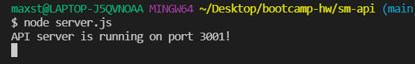

# sm-api

## Description
The purpose of this project was to create a social media network application with mongoDB and mongoose. Once the app is started via node server.js, the user must open insomnia to run all CRUD operations. While creating this project, I got expierence with mongoDB and mongoose connections. I also got more expierence with CRUD operations. 

## Table of Contents 
- [Installation](#installation)
- [Usage](#usage)
- [Credits](#credits)
- [License](#license)
- [Features](#features)

## Installation
In order to run this application, the moment, express, and mongoose packages need to be installed. If there is no package.json file, run npm init. Then install the packages individually or in bulk. The user must also have mongoDB for this application. 

## Usage
The application's server can be started by running node server.js in the VSCode integrated terminal. 

Then open insomnia and follow the tutorial to create/update/delete users, friends,thoughts, and reactions. The video tutorial can be found here [Video tutorial](https://drive.google.com/file/d/1MMIpBbwc7BZ5VOFYcXWV50Fdk1J7QUhx/view?usp=sharing). The server start up is not in the video because changing windows stops screen recording with the application I use to record. My code is available on my GitHub, [here](https://github.com/MaxStump13/sm-api)

## Credits

1. [MDN](https://developer.mozilla.org/en-US/)
2. [W3](https://www.w3schools.com/)
3. [mongoose](https://mongoosejs.com/docs/guides.html)
4. [npmjs](https://www.npmjs.com/package/inquirer)
5. [Youtube](https://www.youtube.com/watch?v=HcRcxcbjKzc)
6. [moment](https://momentjs.com/)

## License

## Features
1. CRUD operations for users, friends, thoughts, and reactions
2. MongoDB and Mongoose server database
3. RegEx email validation

## How to Contribute
If there are any suggestions to improve this generator, this is my [GitHub](https://github.com/MaxStump13) account. 